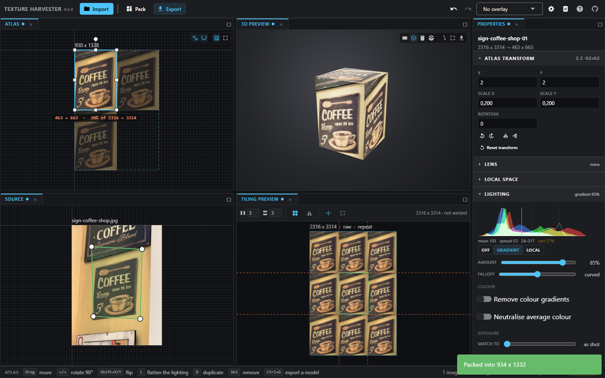
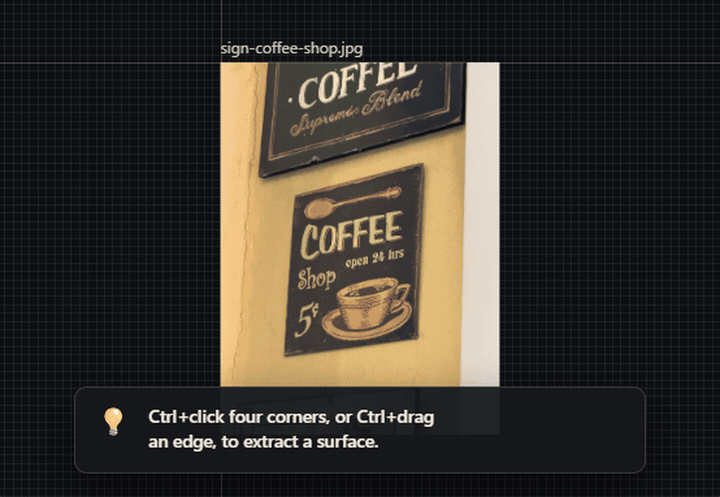
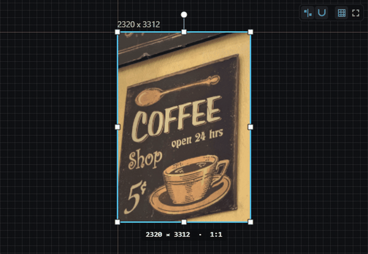
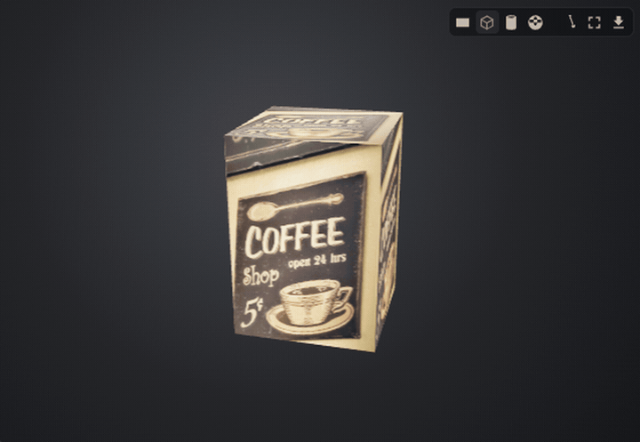
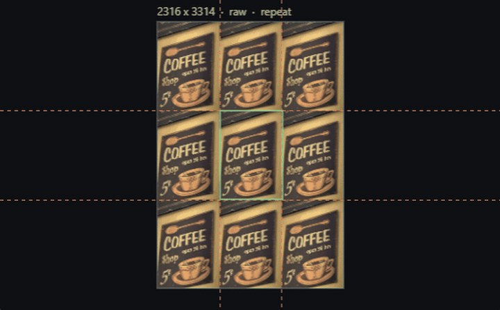
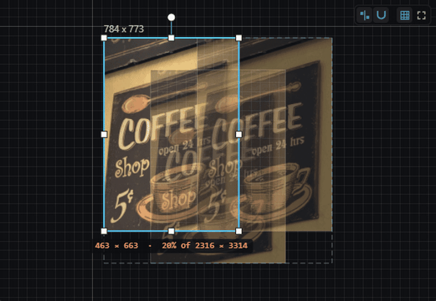

# Texture Harvester

Mark a surface in a photograph, get a flat tiling texture with a full PBR material out.

**Live:** [beamng.github.io/TextureHarvester](https://beamng.github.io/TextureHarvester/)




## Why try it

Small features that usually mean opening three other tools.

### Drag an edge — land a flat tile
Ctrl+drag (or long-press and drag on touch) marks a whole edge. Two opposite edges, or two that meet, finish the quad and the flattened patch appears on the Atlas.



### Flatten the lighting baked into the photo
Press **L** to estimate illumination and divide it out, so engines do not double-light shadows that were already in the shot.



### Auto PBR, judged in 3D
After extract, optional auto-maps fill normal / roughness / cavity. Orbit the lit mesh (plane, box, cylinder, sphere) and export a GLB with the same maps and lights (**Ctrl+G**).



### See the seam, then kill it
Tiles shows a repeat grid with optional seam lines — the honest check that a weld or mirror actually worked.



### Pack a tight atlas sheet
Scatter slices on the sheet, hit **Pack**, get a dense layout with padding and optional power-of-two sizing.



### And the rest of the sticky bits
- **Pixel loupe** while placing corners (Ctrl / Shift / long-press) — mortar lines, not guesswork
- **Weld shared corners** across marks so adjacent extracts line up
- **Mark past the photo edge** — overhang stays transparent in the extract
- **Depth bow** (optional in-browser model) shapes the 3D mesh and normals
- **Example café signs** from the intro — first extract without hunting for a photo
- **One self-contained HTML file** — no server, no install, works offline once loaded

## Develop

```bash
npm install
npm run dev      # http://localhost:5173, hot reload
npm run build    # dist/index.html, one file
npm test         # selftest, inttest and uitest in headless Chrome
```

Regenerate the feature GIFs (needs Playwright + ffmpeg):

```bash
node build.mjs
node scripts/capture-readme.mjs
```
